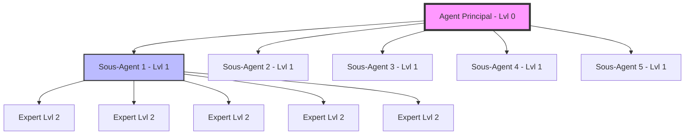

# 🚀 Antigravity Agent Project

**Boîte à outils complète de 39 agents IA ultra-spécialisés**, propulsée par le [SDK Antigravity](https://github.com/google-antigravity/antigravity-sdk-python).

Ce projet implémente également un **Orchestrateur Hiérarchique** permettant d'exécuter n'importe quel agent avec un réseau de **31 agents en cascade** (1 agent principal + 5 sous-agents de niveau 1 + 25 sous-agents de niveau 2).

---

## 📦 Installation

```bash
# Cloner le repo
git clone https://github.com/theriderymarketing/antigravity-agent-project.git
cd antigravity-agent-project

# Créer un environnement virtuel
python3 -m venv venv
source venv/bin/activate

# Installer les dépendances
pip install -r requirements.txt
```

---

## 🎯 Utilisation rapide

### Mode classique (Chat direct avec 1 agent)

```bash
python main.py
```

### Mode Hiérarchique (Réseau de 31 agents) 🔥 NEW

Exécutez n'importe quel agent avec une délégation et une synthèse hiérarchique sur 3 niveaux :
```bash
python main_hierarchical.py
```
*Le script vous proposera un menu interactif pour choisir la catégorie (juridique, dev, finance...), l'agent, et saisir votre prompt.*

---

## 🏗️ L'Architecture Multi-Agents (1-5-25)

Lors du lancement en mode hiérarchique :
1. **L'Agent Principal (Lvl 0)** conçoit une structure multi-agents adaptée au problème.
2. Il recrute **5 sous-agents spécialisés (Lvl 1)** en parallèle.
3. Chaque sous-agent de niveau 1 recrute à son tour **5 spécialistes très précis (Lvl 2)**.
4. Les résultats remontent la hiérarchie avec des phases de validation et de synthèse successives.



---

## 🤖 Catalogue des Agents (39 Agents)

### 🔧 Dev — `agents/dev/`
- **🐛 Debugger** (`debug_agent.py`) : Analyse les bugs, identifie la cause racine et propose un correctif.
- **♻️ Refactoring** (`refactor_agent.py`) : Détecte les codes smells et applique les principes SOLID.
- **🔍 Code Review** (`code_review_agent.py`) : Évalue la qualité, le nommage et la sécurité.
- **🧪 Test Generator** (`test_generator_agent.py`) : Génère des tests unitaires pytest exhaustifs.
- **📝 Documentation** (`doc_agent.py`) : Produit docstrings, README et documentation API.

### 💼 Business — `agents/business/`
- **🔎 SEO** (`seo_agent.py`) : Analyse de balises meta, headings et mots-clés.
- **✍️ Copywriting** (`copywriting_agent.py`) : Génère newsletters, landing pages et posts sociaux.
- **📊 Data Analysis** (`data_analysis_agent.py`) : Résumé statistique, tendances et anomalies (CSV/JSON).
- **📅 Content Planner** (`content_planner_agent.py`) : Création de calendriers éditoriaux et stratégies multi-canaux.

### ⚙️ DevOps — `agents/devops/`
- **🛡️ Sécurité** (`security_audit_agent.py`) : Scan de vulnérabilités, secrets durs et failles d'injection.
- **🔄 CI/CD** (`ci_cd_agent.py`) : Génération de workflows GitHub Actions et de Dockerfiles.
- **🏗️ Infrastructure** (`infra_agent.py`) : Terraform, Docker Compose et Kubernetes.
- **📡 Monitoring** (`monitoring_agent.py`) : Logging, alertes et routes de santé applicative.

### 🎨 Creative — `agents/creative/`
- **💡 Brainstorming** (`brainstorm_agent.py`) : Idéation créative avec méthodes SCAMPER et mind mapping.
- **🎨 UI/UX Design** (`ui_design_agent.py`) : Audit d'interface, accessibilité (WCAG) et responsive.
- **🏷️ Naming** (`naming_agent.py`) : Génère des propositions de noms inspirés.

### ⚖️ Juridique — `agents/juridique/`
- **📜 Rédacteur de Contrats** (`contrat_agent.py`) : Analyse et rédaction de NDA, CGV, prestataires, SLA.
- **🔐 Conformité RGPD** (`rgpd_agent.py`) : Audit RGPD, politiques de confidentialité et AIPD.
- **⚖️ Propriété Intellectuelle** (`propriete_intellectuelle_agent.py`) : Gestion des licences et compatibilités.
- **💼 Analyse Contentieux** (`contentieux_agent.py`) : Mises en demeure et résolution de litiges.
- **📰 Veille Juridique** (`veille_juridique_agent.py`) : Veille réglementaire et fiches de conformité.

### 💰 Finance — `agents/finance/`
- **📊 Comptabilité** (`comptabilite_agent.py`) : Écritures comptables, bilans et déclarations TVA.
- **🏛️ Fiscalité** (`fiscalite_agent.py`) : Conseils en fiscalité (CIR, JEI, conventions).
- **📈 Business Plan** (`business_plan_agent.py`) : Prévisions de trésorerie, plans de financement et seuils.
- **🧾 Facturation** (`facturation_agent.py`) : Génération automatique de factures et devis conformes.
- **🪙 Investissement** (`investissement_agent.py`) : Calculs de ratios (ROI, DCF, EBITDA) et due diligence.

### 👥 RH — `agents/rh/`
- **🤝 Recrutement** (`recrutement_agent.py`) : Fiches de postes, scoring de CV et grilles d'entretien.
- **🏫 Formation** (`formation_agent.py`) : Ingénierie pédagogique, quiz et parcours de compétences.
- **🛡️ Droit Social** (`droit_social_agent.py`) : Conseils en droit du travail, licenciements, ruptures.
- **👋 Onboarding** (`onboarding_agent.py`) : Parcours d'intégration de nouveaux collaborateurs (30-60-90 jours).
- **🎯 Performance** (`performance_agent.py`) : Évaluation de la performance, OKR, KPI et feedback 360°.

### 🏠 Immobilier — `agents/immobilier/`
- **🏡 Estimation Immo** (`estimation_agent.py`) : Estimation immobilière selon les comparables.
- **📝 Rédaction Baux** (`bail_agent.py`) : Rédige des baux d'habitation (ALUR) ou commerciaux (Pinel).
- **📋 Diagnostics** (`diagnostic_agent.py`) : Vérification et conformité des diagnostics obligatoires (DPE, etc.).
- **💰 Investissement Immo** (`investissement_immo_agent.py`) : Calcule de rentabilité, cashflow et fiscalité (LMNP).

### 🎓 Éducation — `agents/education/`
- **📚 Créateur de Cours** (`cours_agent.py`) : Conception de modules de cours par objectifs.
- **🧩 Générateur de Quiz** (`quiz_agent.py`) : Génération automatisée d'évaluations et corrigés.
- **🎓 Tuteur Interactif** (`tuteur_agent.py`) : Accompagnement pédagogique par méthode socratique.
- **🗺️ Orientation Pro** (`orientation_agent.py`) : Conseils d'orientation et métiers.

---

## 📖 Interface Web (GitHub Pages)

Découvrez le Hub interactif de tous nos agents sur : **[https://theriderymarketing.github.io/antigravity-agent-project/](https://theriderymarketing.github.io/antigravity-agent-project/)**

## 📄 Licence

MIT
